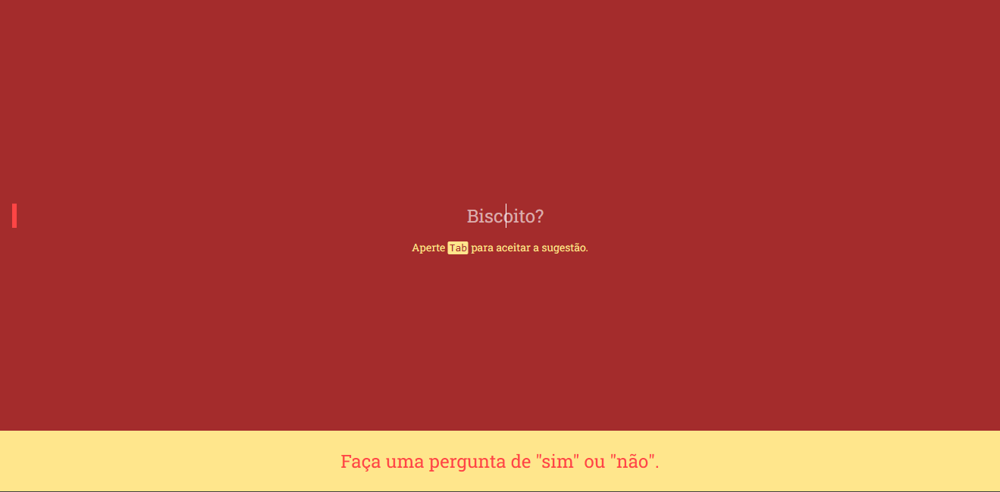

# Dialogger

  

[](https://davidsonbrsilva.github.io/dialogger)

[[Veja em Português](README.pt-br.md)]

**Dialogger** is a fun yes-or-no question-and-answer web application built to practice UI development with CSS in React and custom event handling in JavaScript. Currently the application is only available in Portuguese (Brazil).

> **Warning:** the application gets random responses from the `https://yesno.wtf/api` api, so no response should be taken into account when making important decisions. We are not responsible for any damage that may result from its misuse. Having said that, enjoy!

## Getting started

Clone the repository:

```
git clone https://github.com/davidsonbrsilva/dialogger.git
```

Install dependencies:

```
yarn
```

Start the app:

```
yarn dev
```

View it on browser at `http://localhost:2325`.

## Roadmap

See our [Issues](https://github.com/davidsonbrsilva/dialogger/issues).

## Contato

If necessary, contact <davidsonbruno@outlook.com>.

## License

[MIT](LICENSE) Copyright (c) 2022 Davidson Bruno.
