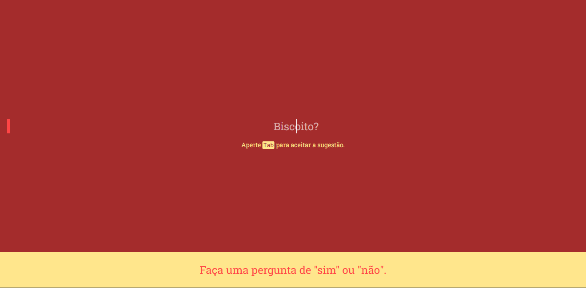

# Dialogger

  

[](https://davidsonbrsilva.github.io/dialogger)

[[See in English](README.md)]

**Dialogger** é uma aplicação web divertida de perguntas e respostas no estilo "sim" ou "não" construída para fins de prática de desenvolvimento de interfaces com CSS em React e manipulação de eventos customizados em JavaScript. Atualmente a aplicação só está disponível em Português (Brasil).

> **Atenção:** a aplicação obtém respostas aleatórias a partir da api `https://yesno.wtf/api`, portanto, nenhuma resposta deve ser levada em conta na tomada de decisões importantes. Não nos responsabilizamos por eventuais prejuízos que possam decorrer de seu mau uso. Uma vez dito isso, divirta-se!

## Executando

Clone o repositório:

```
git clone https://github.com/davidsonbrsilva/dialogger.git
```

Instale as dependências:

```
yarn
```

Inicialize a aplicação:

```
yarn dev
```

Visualize-a no navegador em `http://localhost:2325`.

## Roadmap

Veja os nossos [Issues](https://github.com/davidsonbrsilva/dialogger/issues).

## Contato

Se necessário, contate <davidsonbruno@outlook.com>.

## Licença

[MIT](LICENSE) Copyright (c) 2022 Davidson Bruno.
